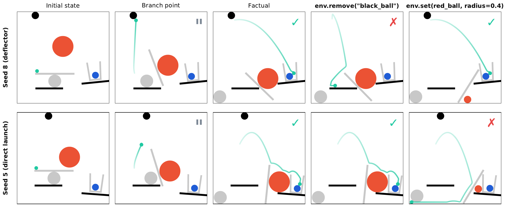

# Counterfactuals

Causal analysis with branching simulations - compare "what happened" vs "what could have happened".

## Overview

This example demonstrates:

- Capturing state at a branch point
- Running factual and counterfactual branches with `env.branch()`
- Comparing outcomes



## Key Concepts

### Counterfactual Reasoning

"Would the outcome have been different if I had intervened?"

1. Run simulation to an event of interest
2. Capture exact state
3. Run two (or more) branches with different interventions
4. Compare outcomes

### Branch Point

The moment where you capture state and diverge into multiple trajectories.

```python
snapshot, step = env.run_until(on_contact("a", "b"), action=...)
# snapshot is the branch point
```

## Branching Pattern

`env.branch(snapshot)` is a context manager that restores the simulation to `snapshot` on both entry and exit. Each `with` block is an independent branch from the same point.

```python
env = InterphyreEnv("level", seed=0, enable_interventions=True)

# Run to branch point
trigger = on_contact("green_ball", "blue_ball")
snapshot, step = env.run_until(trigger, action=action, max_steps=500)

# Factual branch
with env.branch(snapshot):
    env.step_physics(200)
    factual_success = env.success

# Counterfactual branch
with env.branch(snapshot):
    env.impulse("green_ball", (10, 5))
    env.step_physics(200)
    counterfactual_success = env.success

# Compare
causal_effect = int(counterfactual_success) - int(factual_success)
```

## Running the Example

```bash
python demos/counterfactuals.py
```

## Expected Output

```
Counterfactual Analysis Demo

1. Running until contact
   Contact at step 343

2. Factual branch (no intervention)
   green_ball final pos: (3.39, -4.46)
   Success: False

3. Counterfactual branch (impulse intervention)
   green_ball final pos: (-2.11, -4.46)
   Success: False

4. Comparison
   Factual: FAILURE
   Counterfactual: FAILURE
   Position divergence: 5.50 units
```

## Multiple Counterfactuals

Test several interventions from the same snapshot:

```python
interventions = [
    ("no_action", None),
    ("impulse_left", lambda e: e.impulse("green_ball", (-10, 0))),
    ("impulse_right", lambda e: e.impulse("green_ball", (10, 0))),
    ("freeze", lambda e: e.set("green_ball", velocity=(0.0, 0.0), angular_velocity=0.0)),
]

results = {}
for name, intervention in interventions:
    with env.branch(snapshot):
        if intervention is not None:
            intervention(env)
        env.step_physics(200)
        results[name] = env.success
```
