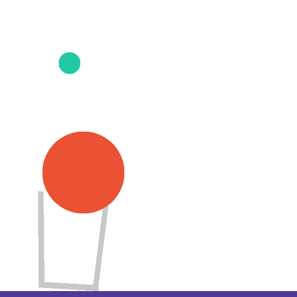

# Basket Case

## Goal

Make sure the green ball hits the purple ground and is not trapped in the basket

## Source

- Level module: `interphyre/levels/basket_case.py`
- Registered name: `basket_case`
