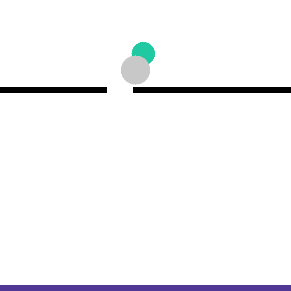

# Mind The Gap

## Goal

Make the green ball hit the ground.

## Source

- Level module: `interphyre/levels/pinhole.py`
- Registered name: `pinhole`
- Note: This level is being renamed to `mind_the_gap` in a separate refactor branch.
